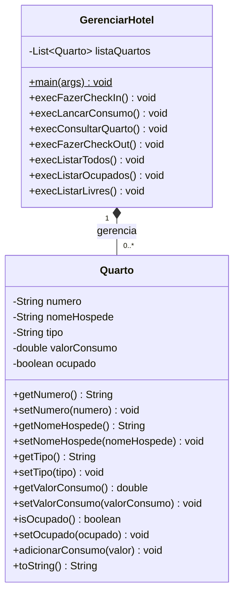

### Atividade Prática: Sistema de Gestão de Quartos de Hotel

**Objetivo da Atividade:**
Aplicar e consolidar os conceitos de Programação Orientada a Objetos (POO), manipulação de listas em memória (`ArrayList`), estruturas de repetição, laços de busca (`for-each`) e alteração de estado de objetos.

**Cenário:**
Um hotel de pequeno porte precisa de um sistema simples no console para gerenciar a ocupação de seus quartos. O sistema deve permitir que o recepcionista cadastre novos quartos ocupados por hóspedes, lance valores referentes ao consumo do frigobar (água, lanches, etc.), consulte os dados de um quarto específico e realize o check-out (liberando o quarto). Além disso, o sistema deve fornecer relatórios rápidos de ocupação.

#### Requisitos do Sistema

Sua tarefa é desenvolver este sistema em Java. Para isso, você precisará criar duas classes principais:

**1. A Classe de Modelo (`Quarto`)**
Esta classe representará cada quarto do hotel. Ela deve conter, no mínimo, os seguintes atributos privativos (lembre-se de gerar os métodos *Getters* e *Setters*):
* **Número do Quarto** (identificador único, ex: "101", "205").
* **Nome do Hóspede** (quem está ocupando o quarto).
* **Tipo do Quarto** (ex: "Simples", "Duplo", "Luxo").
* **Valor de Consumo** (começa em 0.0 e armazena o valor gasto com o frigobar).
* **Ocupado** (um valor booleano que indica se há alguém no quarto. `true` = Ocupado, `false` = Livre).

*Dica:* Crie um método na classe `Quarto` chamado `adicionarConsumo(double valor)` que some o valor recebido ao total de consumo atual do quarto. Não se esqueça de sobrescrever o método `toString()` para imprimir as informações do quarto de forma legível.

**2. A Classe de Gerenciamento (`GerenciarHotel`)**
Esta classe conterá o método `main` e a lógica do menu iterativo. Ela deve possuir uma lista (`ArrayList`) para armazenar os objetos do tipo `Quarto`. 

O menu principal deve rodar em *loop* (utilizando `do-while`) e exibir as seguintes opções para o usuário:

* **Opção 1 - Fazer Check-in (Cadastrar Quarto):** Solicita ao usuário o número do quarto, o nome do hóspede e o tipo de quarto. O valor de consumo deve ser iniciado em `0.0` e o status de ocupação deve ser definido como `true` (Ocupado). O objeto criado deve ser adicionado à lista.
* **Opção 2 - Lançar Consumo:** Solicita o número do quarto. O sistema deve buscar na lista se este quarto existe. Se existir, solicita o valor do item consumido e adiciona à conta do quarto. Se não existir, exibe uma mensagem de erro.
* **Opção 3 - Consultar Quarto:** Solicita o número do quarto e exibe todos os dados dele (nome do hóspede, tipo, status e conta atual).
* **Opção 4 - Fazer Check-out (Liberar Quarto):** Solicita o número do quarto a ser liberado. O sistema deve buscar o quarto e alterar seu status booleano para `false` (Livre), indicando que o hóspede foi embora e o quarto está pronto para limpeza.
* **Opção 5 - Listar Todos os Quartos:** Percorre a lista e exibe todos os quartos já registrados no sistema, independente do status.
* **Opção 6 - Listar Quartos Ocupados:** Percorre a lista e exibe apenas os quartos cujo status booleano seja `true`.
* **Opção 7 - Listar Quartos Livres:** Percorre a lista e exibe apenas os quartos cujo status booleano seja `false`.
* **Opção 9 - Sair:** Encerra a execução do programa.

#### Regras Adicionais
* Valide as buscas! Sempre que o recepcionista for lançar um consumo, consultar ou fazer check-out, o sistema deve informar caso o número do quarto digitado não seja encontrado na lista.
* Utilize o laço `for-each` para realizar as buscas e listagens.

