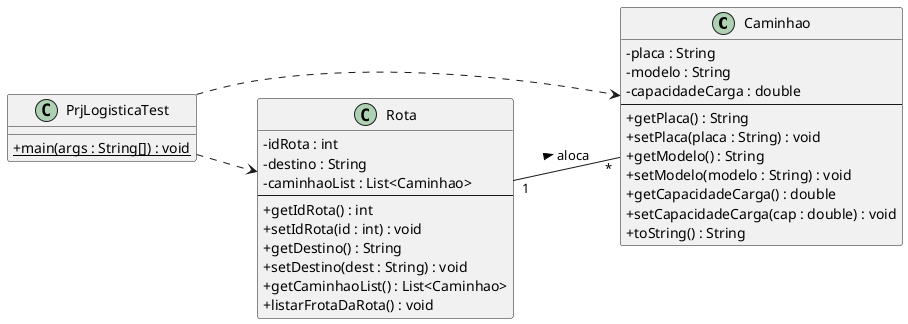

## Exercício Prático: Sistema de Gestão de Logística

### Cenário
Uma transportadora precisa de um sistema para gerenciar suas **Rotas** e os **Caminhões** que estão alocados em cada uma delas. Uma rota possui uma cidade de destino e uma distância total em quilômetros. Cada caminhão possui uma placa, um modelo e sua capacidade de carga.

### Diagrama de Classes (UML)
Em anexo está a representação das classes que devem ser implementadas

### Atividades

**Questão 1. [1,5 pontos]**
Implemente a classe **`Caminhao`**.
* Crie os atributos privados conforme o diagrama.
* Gere os métodos `getters` e `setters`.
* Implemente o método `toString()` para retornar uma String formatada com os dados do veículo.

**Questão 2. [3,0 pontos]**
Implemente a classe **`Rota`**.
* O atributo `caminhaoList` deve ser do tipo `List<Caminhao>` e inicializado como um `ArrayList<>`.
* Implemente o método **`listarFrotaDaRota()`**. Este método deve exibir o destino da rota e fazer uma varredura (loop) na lista de caminhões, imprimindo os dados de cada caminhão alocado naquela rota.

**Questão 3. [3,0 pontos]**
Implemente a classe **`PrjLogisticaTest`** com o método `main`:
1.  Instancie uma **Rota** (Ex: Destino "Curitiba", ID 500).
2.  Instancie **dois Caminhões** com dados distintos.
3.  Adicione os dois caminhões à lista da rota criada.
4.  Chame o método `listarFrotaDaRota()` para exibir o relatório no console.

**Questão 4. [2,5 pontos]**
Sobre os conceitos de POO aplicados:
* Explique o que é a **instanciação** realizada na classe de teste.
* No método `listarFrotaDaRota`, qual seria a consequência de tentar acessar a lista se ela não tivesse sido inicializada com `new ArrayList<>()`?

---

